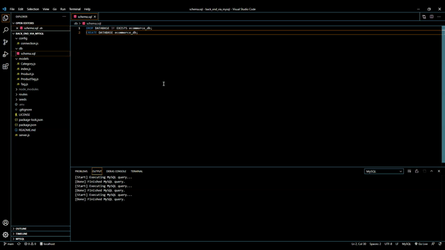
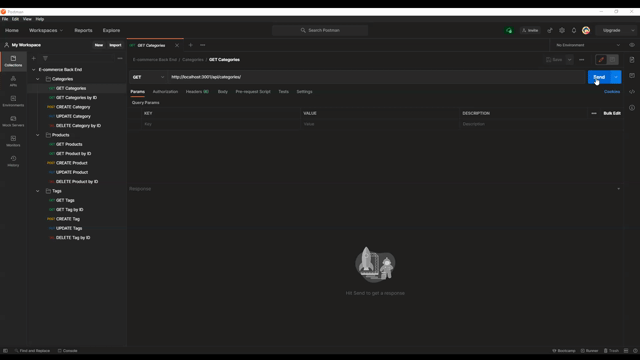
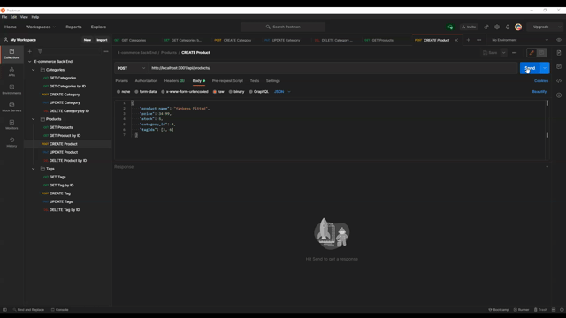
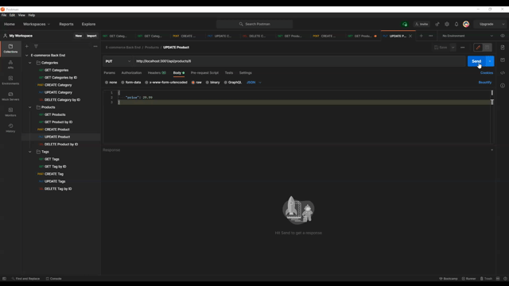
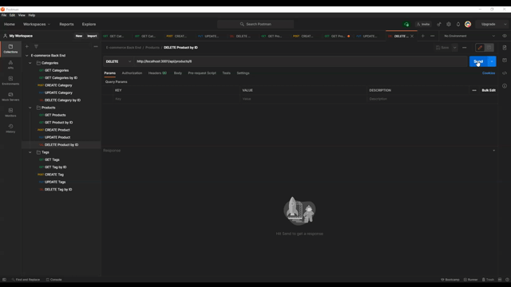
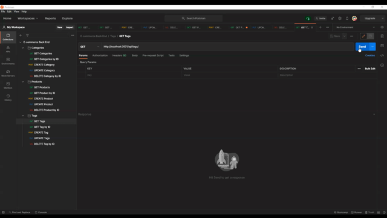
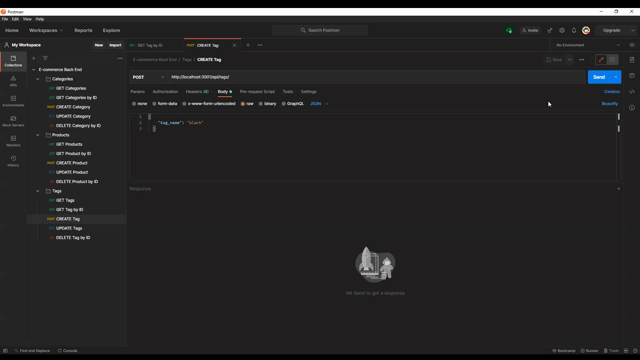

# back_end_via_mysql
Back end for an e-commerce site by modifying starter code using Express.js API with Sequelize to interact with MySQL.

  
---
## Author
  
Shawn Fox
  
  
| [GitHub](https://github.com/sfoxgit) | [Email](sfoxgit@gmail.com) |
  
---
## Project Links:
  
- Deployed site: [GitHub Pages]()
  
- GitHub: [sfoxgit](https://github.com/SFoxGit/back_end_via_mysql)
  
---
## Table of Contents
  
- [Description](##Description)
  
- [Installation](##Installation)
  
- [Usage](##Usage)
    
- [Questions](##Questions)
  
- [License](##License)
  
- [Contributions](##Contributing)
  
- [Credits](##Credits)
  
---
## Description
  
---
## Installation

Run the schema, (copy and paste into mysql workbench or using mysql vsc extension)

npm seed

  
---
## Usage

npm start

Get Categories

Put Push Delete Categories

Get Products

Post Products

Put Products

Delete Products

Get Tags

Post Tags

Put Tags

Delete Tags

  
---
## Questions
  
If you have any questions or concerns please contact me at sfoxgit@gmail.com or any of my contact information above. [Back to Author](##Author) 
  
--- 
 
## License 
 
https://opensource.org/licenses/MIT
  
---
## Contributing
  
If you'd like to contribute, please contact me.
  
---
## Credits
  
 Trilogy Education Services, LLC for the starter code.
  

